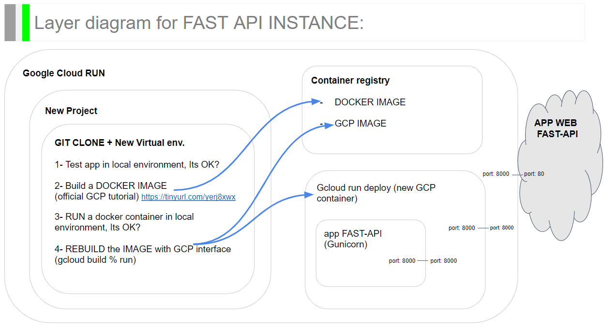

# Proyecto escuela calculo de indice de retrabajo, en obras edilicias de New York City

## Hipotesis: 
Se plantea la hipotesis de determinar un indice de retrabajo, basado en la relacion existente entre: 
+ Permisos de inicio de obra VS. Permisos de renovacion de obra

se asume que el ratio: `Renovacion/ Inicio` Podria dar informacion valiosa al momento de elegir la empresa contratista, en funcion de la zona geografica o en funcion del tipo de edificio.

# Front-end del modelo:

[FrontEnd - streamlit](https://axissn01-fastapi-gcp-streamlit-mvp-ui-2swe87.streamlitapp.com/)

# Back-end del modelo:

[BackEnd - Fast API](https://fastapi-mvp-app-dzvcjejuga-uc.a.run.app/docs)

--- 

# Arquitectura de los datos

# Digrama de capas de la implementacion de FAST API

--- 

